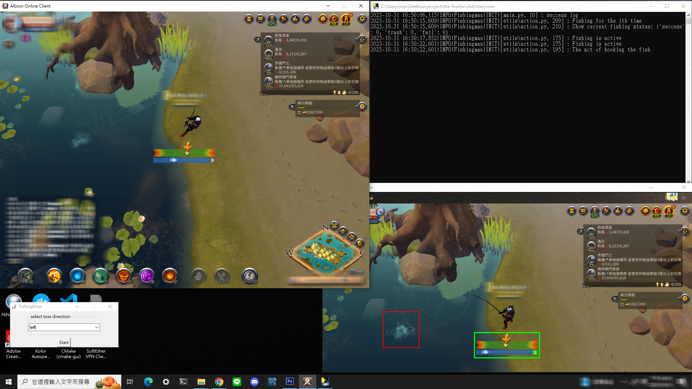

# Albion-Fishing Man v1 

## Table of Contents
1. [中文](README.md)
2. [English](EN.md)

#### Features
- **Automation**: Automatically controls the mouse for fishing.
- **Safety**: Mimics human operations, lessening the risk of detection by anti-cheat systems.
- **Customization**: Users can select the fishing direction and adjust the recognition areas on their screen.

#### Demonstration Screen


## How to Use

### Install Dependencies
```sh
pip install -r requirements.txt 
```
#### Run the Script
```sh
python main.py
```

## Game Configuration
- Resolution: 1024 x 768
- Shadows: Off
- Other settings should be set to the lowest to ensure optimal performance.

## Operation Steps
- 1. `Set Fishing Direction`: Select which direction the character is facing towards the lake.
- 2. `Calibrate Hook Frame`: Press F5 to verify the red frame is correctly positioned around the hook.
        > Note: If incorrect, drag the red frame on the sub-screen to adjust its position, then restart the program.
- 3. `Calibrate Arrow Frame`: Fish manually once to check if the green frame encompasses the arrow.
        > Note 1: If the green frame does not enclose the arrow, retake the screenshot to match the style of images/label2.png and replace it.

        > Note 2: The task's lower green frame should match the yellow arrow after fishing for image detection. If the green frame does not match the fishing bar length, adjust so the yellow arrow fits inside the green frame.
    
- 4. `Start Automated Fishing`: Once everything is set, press `Enter` to begin the automation.
        > Note: The program will adjust parameters if there's no fishing action within 1 minute.

## Compile Executable
To create a standalone executable, run:
```sh
pyinstaller --onefile main.py
```


## FAQs
`Q`: What if the program detects fishing but doesn't reel in?
`A`: Ensure the yellow arrow is within the large green frame on the bar. If not, adjust the main program window position.

`Q`: What if the yellow arrow is within the green frame but not detected?
`A`: This could mean a resolution mismatch. Retake a screenshot with your computer and replace label2.png.