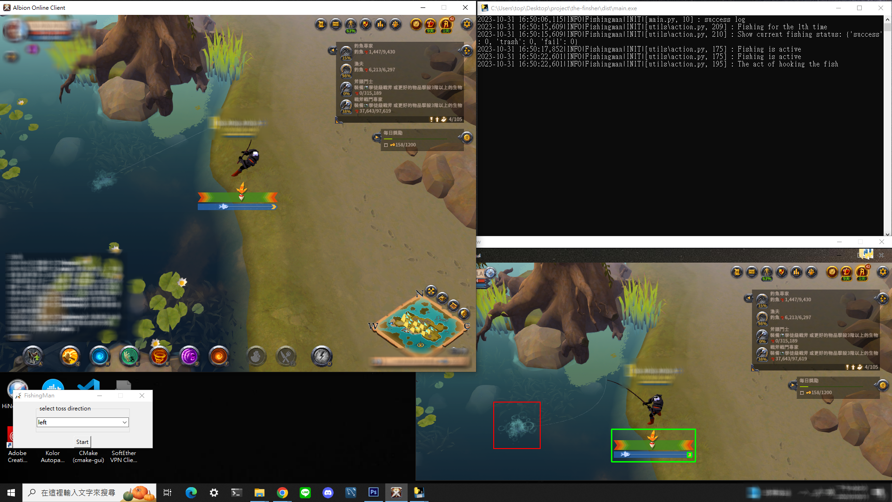
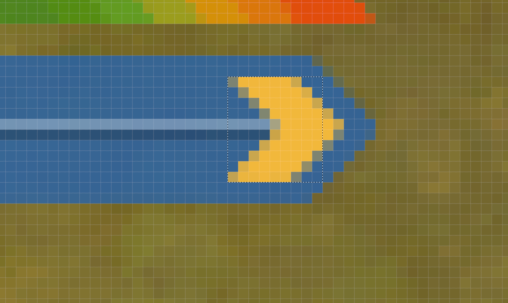

# Albion-Fishing Man v1 介紹
## 目錄
1. [中文](README.md)
2. [English](EN.md)

#### 特點
- 自動化: 自動控制滑鼠進行釣魚。
- 安全性: 由於它模擬人類操作，因此風險較低，不大可能被遊戲的反作弊系統檢測到。
- 定制化: 允許用戶選擇釣魚的方向，並根據屏幕上的實際情況調整識別區域。

#### 展示畫面


## 使用方法

安裝依賴
```sh
pip install - r requirement.txt 
```
運行腳本
```sh
python main.py
```

## 遊戲配置
- 解析度: 1024 x 768
- 陰影: 關閉
- 其它配置: 請選擇最低規格的配置即可 

## 操作步驟
- 1. `設定釣魚方向`: 選擇人物面對湖面的方向，即釣魚方向。
- 2. `校準鉤鉤框`: 按下 F5 確認紅框是否正確框住魚鉤。
        > 注意: 如有誤差,請在子畫面中按住紅線框進行拖曳,拖曳至理想的位置後重新啟動程式
- 3. `校準箭頭框`: 手動釣魚一次，確認綠框是否框住箭頭。
        > 注意1: 如果沒有綠線框住請重新截圖,遵照images/label2.png的樣態擷取,並取代label2.png
        > 注意2: 任務下方的綠框,請將釣魚後出現的黃色箭頭的圖案對應至綠框內即可進行圖片判斷,有可能出現綠框與釣魚拉條長度不一的情況,請以黃色箭頭能塞入綠框內為主
    
- 4. 上述沒問題請按下`Enter`即可進行自動化釣魚
        > 注意: 如果 1 分鐘內無釣魚動作，程式會嘗試更換參數。
    

## 編譯執行檔
```sh
pyinstaller --onefile main.py
```

## 問題與解答
Q. 如果有偵測出釣魚,卻沒有後續拉桿的動作怎麼辦?
A. 請確認釣魚出現的拉條中的黃色箭頭是否以在大綠框內,如果沒有請拖曳主程式位置並對齊

Q. 如果黃色箭頭有在綠框內但是卻無法偵測箭頭位置怎麼辦?
A 代表解析度不同,需重新截圖,請用您到電腦截圖後替換label2.png


